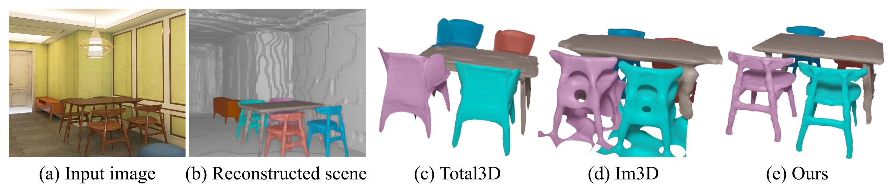

# Towards High-Fidelity Single-view Holistic Reconstruction of Indoor Scenes (ECCV 2022)
<p align="center"></p></br>
This is the repository of our paper 'Towards High-Fidelity Single-view Holistic Reconstruction of Indoor Scenes' in ECCV 2022<br>
Paper - <a href="https://arxiv.org/pdf/2207.08656" target="__blank">ArXiv - pdf</a> (<a href="https://arxiv.org/abs/2207.08656" target="__blank">abs</a>) 
<br>

# Environment
prerequsite

1. CUDA 11.1
2. pytorch 1.9.0
3. torchvision 0.10.0

after installing the above software, run the following commands for installing others packages:
```angular2html
pip install -r requirements.txt
```

# Data Preparation
### 3D FRONT dataset
The prepare data for training is in the following link: <a href="https://cuhko365-my.sharepoint.com/:f:/g/personal/115010192_link_cuhk_edu_cn/Eg99g4P1VMVJoZ5fz3lmDkABvj7Gc7yCjq-qBuYNqWjl2w?e=72lix4" target="__blank">training_data</a>.
Download prepare_data.zip, occ.zip, mask.zip, and unzip them under ./data/3dfront. 
# Code
Codes for single-view object reconstruction is already released.
The codes for 3D object detection and backgrounding reconstruction will be updated in a few days.

## Object Reconstruction
### Training
run the following commands for training:
```angular2html
python main.py --mode train --config ./configs/train_instPIFu.yaml
```
After the training is finished, the weight file will be stored in ./checkpoints/<exp_name>/model_best.pth.
### Testing
run the following commands to extract mesh result:
```angular2html
python main.py --mode test --config ./configs/test_instPIFu.yaml
```
we provide weight file in <a href="https://cuhko365-my.sharepoint.com/:u:/g/personal/115010192_link_cuhk_edu_cn/EUCaLPeAr_9HhX05X6VMB30BEiK-mp4GKl1tmTJMOQL1ng?e=vuBMdu" target="__blank">model_best.pth</a>.
you can download it for testing on 3D-FRONT data.
The weight entry in the config file is required to be modified to the weight file that you want to test. 
The mesh files will be saved in ./checkpoints/<exp_name>/xxx.ply
<\br>
### Evaluation
For evaluation, gaps is required to be installed for conduct ICP alignment. Run the following commands to install gaps:
```angular2html
cd external
bash build_gaps.sh
```
Download the <a href="https://cuhko365-my.sharepoint.com/:u:/g/personal/115010192_link_cuhk_edu_cn/Eb5ntiV22HlJmiQWNsNQycsBRovAVlTpbiFEV5yeITdYGQ?e=QbzaTG" target="__blank">ground truth mesh in test set </a>, and unzip it.
run the following commands for evaluation:
```angular2html
python evaluate_object_reconstruction.py --result_dir ./checkpoints/<exp_name> --gt_dir ./Path/to/gt/watertight/mesh
```
evaluation is only conducted on 2000 samples inside ./data/3dfront/split/test.json
evaluation results on 3D-FUTURE:

| Category         | cabinet | chair | table | sofa | bed  | night_stand | Total |
|:-----------------|:--------|:------|:------|:-----|:-----|:------------|:------|
| Chamfer Distance | 4.25    | 9.93  | 15.00 | 6.42 | 9.92 | 17.08       | 10.61 |

## Background reconstruction
### training
The occupancy data for background is already updated in <a href="https://cuhko365-my.sharepoint.com/:f:/g/personal/115010192_link_cuhk_edu_cn/Eg99g4P1VMVJoZ5fz3lmDkABvj7Gc7yCjq-qBuYNqWjl2w?e=72lix4" target="__blank">training_data</a>.
<br>
run the following commands to train background reconstruction:
```angular2html
python main.py --mode train --config ./configs/train_bg_PIFu.yaml
```
run the following commands to extract background mesh:
```angular2html
python main.py --mode test --config ./configs/test_bg_PIFu.yaml
```
you can also try to use the pretrained weight at <a href="https://cuhko365-my.sharepoint.com/:u:/g/personal/115010192_link_cuhk_edu_cn/EUCaLPeAr_9HhX05X6VMB30BEiK-mp4GKl1tmTJMOQL1ng?e=1CkqRW" target="__blank">model_best_bg.pth</a>.
And modify the weight entry in the configuration file as your weight path <br>
background ground truth depth map is inside <a href="https://cuhko365-my.sharepoint.com/:f:/g/personal/115010192_link_cuhk_edu_cn/Eg99g4P1VMVJoZ5fz3lmDkABvj7Gc7yCjq-qBuYNqWjl2w?e=72lix4" target="__blank">training_data</a> 
as bgdepth.zip, unzip this file and put it under ./data/3dfront
run the following commands to evaluate background reconstruction:
```angular2html
python evaluate_bg.py --gt_dir ./data/3dfront/bgdepth --result_dir ./checkpoints/xxx
```

# To Do
- [x] Codes for background reconstruction
- [x] Evaluation for background reconstruction
- [ ] Codes for 3D object detection
- [ ] Train and test on pix3d dataset
# Citation
If you find our work useful, please cite
```angular2
@inproceedings{liu2022towards,
  title={Towards High-Fidelity Single-view Holistic Reconstruction of Indoor Scenes},
  author={Liu, Haolin and Zheng, Yujian and Chen, Guanying and Cui, Shuguang and Han, Xiaoguang},
  booktitle={Proceedings of European Conference on Computer Vision},
  year={2022}
}
```

