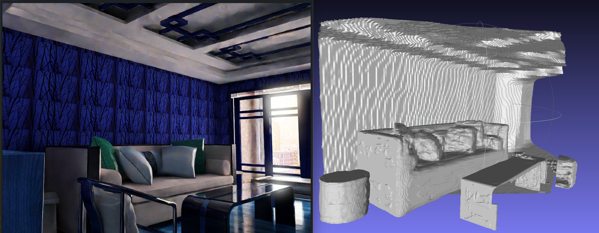

# Towards High-Fidelity Single-view Holistic Reconstruction of Indoor Scenes (ECCV 2022)
<p align="center"></p></br>
This is the repository of our paper 'Towards High-Fidelity Single-view Holistic Reconstruction of Indoor Scenes' in ECCV 2022<br>
Paper - <a href="https://arxiv.org/pdf/2207.08656" target="__blank">ArXiv - pdf</a> (<a href="https://arxiv.org/abs/2207.08656" target="__blank">abs</a>) 
<br>

# Environment
prerequsite

1. CUDA 11.1
2. pytorch 1.9.0
3. torchvision 0.10.0

after installing the above software, run the following commands for installing others packages:
```angular2html
pip install -r requirements.txt
```

# Data Preparation
### Pix3D dataset
download prepared pix3d data in the following link: <a href="https://cuhko365-my.sharepoint.com/:u:/g/personal/115010192_link_cuhk_edu_cn/Ed3a-GoWfRpLpug1T9Up000Bn7L7NU5kDAk5Q9izx5LQmg?e=Ykjgtq" target="__blank">pix3d_data.zip</a>. Unzip the folder and put the pix3d folder under ./data.
### 3D FRONT dataset
The prepare data for training is in the following link: <a href="https://cuhko365-my.sharepoint.com/:f:/g/personal/115010192_link_cuhk_edu_cn/Eg99g4P1VMVJoZ5fz3lmDkABvj7Gc7yCjq-qBuYNqWjl2w?e=72lix4" target="__blank">training_data</a>.
Download prepare_data.zip, occ.zip, mask.zip, and unzip them under ./data/3dfront. 

**Ps.** The zip file is compressed on **Windows**, it should be fine to unzip it using **winRAR**. If you encounter error during unzip in **Linux**, try to use **7zip** to unzip the file.
### Preprocessing Scripts
First, install Manifold, which can be refered to <a href="https://github.com/hjwdzh/Manifold" target="__blank">Manifold</a>.
Then, cd into data_preparation folder, run the following commands to convert 3D FUTURE CAD model into watertight model (make sure manifold_root points to the executable file):
```angular2html
python prepare_watertight.py --data_root <pathTo3DFuture> --save_root <PathToSave> --manifold_root <PathToInstallManifold>
```
and run the following commands to sample occupancy for 3D FUTURE dataset. 
```angular2html
python sample_points.py --data_root <pathTo3DFutureWatertight> --target_root <PathToSave>
```
Make sure to install trimesh with embree to accelerate the computation. <br>
Then, download <a href="https://cuhko365-my.sharepoint.com/:u:/g/personal/115010192_link_cuhk_edu_cn/EVmihvDBfmVBgR-bHWpDZIsBco3-0cYFRdEQLJlbJBLnGg?e=bUmbbX" target="__blank">3d-front-layout.zip</a>.
This folder will be used in the later script as layout_root. You can choose to generate your own layout for 3D-FRONT, but you will need to extract the depth image from the prepare_data.zip in the OneDrive Shared Folder, 
the desc.json will be provided in <a href="https://cuhko365-my.sharepoint.com/:u:/g/personal/115010192_link_cuhk_edu_cn/EVmihvDBfmVBgR-bHWpDZIsBco3-0cYFRdEQLJlbJBLnGg?e=Z1DaYx" target="__blank">3d-front-object.zip</a>.
```angular2html
python preprocess_layout.py --data_root <pathToFrontRawData> --save_root <PathToSave>
```
And download <a href="https://cuhko365-my.sharepoint.com/:u:/g/personal/115010192_link_cuhk_edu_cn/EVmihvDBfmVBgR-bHWpDZIsBco3-0cYFRdEQLJlbJBLnGg?e=Z1DaYx" target="__blank">3d-front-object.zip</a>.
This folder will be used in the later script as data_root.
Run the following commands to preprocess detection data by:
```angular2html
python preprocess_detection_data.py --data_root <pathToFrontRawData> --save_root <pathToSave> --FRONT3D_root <pathTo3DFrontDataset> --layout_root <pathToFront3DLayout>
```
FRONT3D_root is a folder extracted from 3D-FRONT.zip, which can be downloaded on the 3D FRONT official website, it contains json files that describe the scene's objects and layout.
This script ignore to merge image and depth data, since they are already provided in <a href="https://cuhko365-my.sharepoint.com/:f:/g/personal/115010192_link_cuhk_edu_cn/Eg99g4P1VMVJoZ5fz3lmDkABvj7Gc7yCjq-qBuYNqWjl2w?e=72lix4" target="__blank">training_data</a>.

## Object Reconstruction
### Training
run the following commands for training:
```angular2html
python main.py --mode train --config ./configs/train_instPIFu.yaml
```
After the training is finished, the weight file will be stored in ./checkpoints/<exp_name>/model_best.pth.
Running the configuraion file ./configs/train_instPIFu_onpix3d.yaml will train instPIFu on pix3d dataset.
### Testing
run the following commands to extract mesh result:
```angular2html
python main.py --mode test --config ./configs/test_instPIFu.yaml
```
we provide weight file in <a href="https://cuhko365-my.sharepoint.com/:u:/g/personal/115010192_link_cuhk_edu_cn/EUCaLPeAr_9HhX05X6VMB30BEiK-mp4GKl1tmTJMOQL1ng?e=vuBMdu" target="__blank">model_best.pth</a>.
you can download it for testing on 3D-FRONT data.
The weight entry in the config file is required to be modified to the weight file that you want to test. 
The mesh files will be saved in ./checkpoints/<exp_name>/xxx.ply
<\br>
weight file for pix3d dataset is in <a href="https://cuhko365-my.sharepoint.com/:u:/g/personal/115010192_link_cuhk_edu_cn/ES4SqMFhnR9DipjSWhBt5C4BomRDF7jO-7AE1v-FaS5l6g?e=V3XTWV" target="__blank">model_best_pix3d.pth</a>.
Download the weigt file, and change the weight entry in ./configs/test_instPIFu_onpix3d.yaml, you will be able to inference on pix3d dataset.
### Evaluation
For evaluation, gaps is required to be installed for conduct ICP alignment. Run the following commands to install gaps:
```angular2html
cd external
bash build_gaps.sh
```
Download the <a href="https://cuhko365-my.sharepoint.com/:u:/g/personal/115010192_link_cuhk_edu_cn/Eb5ntiV22HlJmiQWNsNQycsBRovAVlTpbiFEV5yeITdYGQ?e=QbzaTG" target="__blank">ground truth mesh in test set </a>, and unzip it.
run the following commands for evaluation:
```angular2html
python evaluate_object_reconstruction.py --result_dir ./checkpoints/<exp_name> --gt_dir ./Path/to/gt/watertight/mesh
```
evaluation is only conducted on 2000 samples inside ./data/3dfront/split/test.json
evaluation results on 3D-FUTURE:

| Category         | cabinet | chair | table | sofa | bed  | night_stand | Total |
|:-----------------|:--------|:------|:------|:-----|:-----|:------------|:------|
| Chamfer Distance | 4.25    | 9.93  | 15.00 | 6.42 | 9.92 | 17.08       | 10.61 |

## Background reconstruction
### training
The occupancy data for background is already updated in <a href="https://cuhko365-my.sharepoint.com/:u:/g/personal/115010192_link_cuhk_edu_cn/EcYJ0FNgIStHiL2MdTCbtksBGWyJu7J2n8HPRM1Ie9M0Pw?e=8sz9QS" target="__blank">bgocc.zip</a>. unzip the folder, and rename the folder as bgocc, then put it under ./data/3dfront/bgocc
<br>
run the following commands to train background reconstruction:
```angular2html
python main.py --mode train --config ./configs/train_bg_PIFu.yaml
```
run the following commands to extract background mesh:
```angular2html
python main.py --mode test --config ./configs/test_bg_PIFu.yaml
```
you can also try to use the pretrained weight at <a href="https://cuhko365-my.sharepoint.com/:u:/g/personal/115010192_link_cuhk_edu_cn/EUCaLPeAr_9HhX05X6VMB30BEiK-mp4GKl1tmTJMOQL1ng?e=1CkqRW" target="__blank">model_best_bg.pth</a>.
And modify the weight entry in the configuration file as your weight path <br>
background ground truth depth map is inside <a href="https://cuhko365-my.sharepoint.com/:f:/g/personal/115010192_link_cuhk_edu_cn/Eg99g4P1VMVJoZ5fz3lmDkABvj7Gc7yCjq-qBuYNqWjl2w?e=72lix4" target="__blank">training_data</a> 
as bgdepth.zip, unzip this file and put it under ./data/3dfront
run the following commands to evaluate background reconstruction:
```angular2html
python evaluate_bg.py --gt_dir ./data/3dfront/bgdepth --result_dir ./checkpoints/xxx
```

## Object detection
Our object detection is based on <a href="https://github.com/chengzhag/Implicit3DUnderstanding" target="__blank">Im3D</a>. There are three stages for training. I release 
the pretrained weight on 3D-Front dataset in <a href="https://cuhko365-my.sharepoint.com/:u:/g/personal/115010192_link_cuhk_edu_cn/EV9gH5NBUApGsmFkDXNHSR0BdCB7wqDRMc_s8Za0C9FpJQ?e=HpBaxn" target="__blank">model_best_det.pth</a>.
It is recommended to use this pretrained weight to generate 3D bounding box and camera pose estimation.
You can download the pretrained weight, and put it under ./checkpoints/det_weight.
Testing is conducted by running the following commands:
```angular2html
python main.py --mode test --config ./configs/inference_object_detection.yaml
```
Detection results can be found in <a href="https://cuhko365-my.sharepoint.com/:u:/g/personal/115010192_link_cuhk_edu_cn/Ef44MzLaMwpClQ_wXXpzTAIBPzOkPZ8CLO89W4XFWIpMzw?e=J1DfNP" target="__blank">detection_result.zip</a>.
Unzip the folder, and make sure to modify the pred_pose_path entry in test_instPIFu.yaml to use the detection results for object reconstruction.
### testing object reconstrution with predicted pose
you can update the entry use_pred_pose, and pred_pose_path (path storing the object detection result) in test_instPIFu.yaml to use the predicted pose during mesh reconstruction.

## Demo
Visualization results can be obtained by running, make sure to run the testid which exists in ./data/3dfront/split/test:
```angular2html
python demo.py --taskid rendertaskxxxx
```
The results will be saved into ./output/rendertaskxxx/*.ply.
<br>
visualization results will be similar as below(testid is rendertask6452):
<p align="center"></p></br>

# Citation
If you find our work useful, please cite
```angular2
@inproceedings{liu2022towards,
  title={Towards High-Fidelity Single-view Holistic Reconstruction of Indoor Scenes},
  author={Liu, Haolin and Zheng, Yujian and Chen, Guanying and Cui, Shuguang and Han, Xiaoguang},
  booktitle={Proceedings of European Conference on Computer Vision},
  year={2022}
}
```

